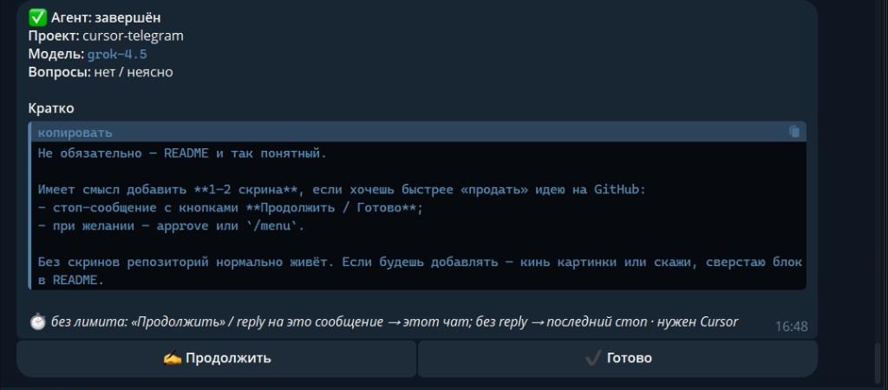
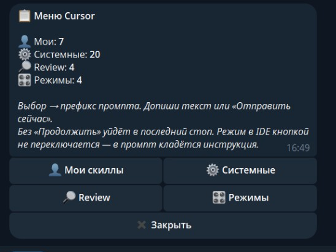
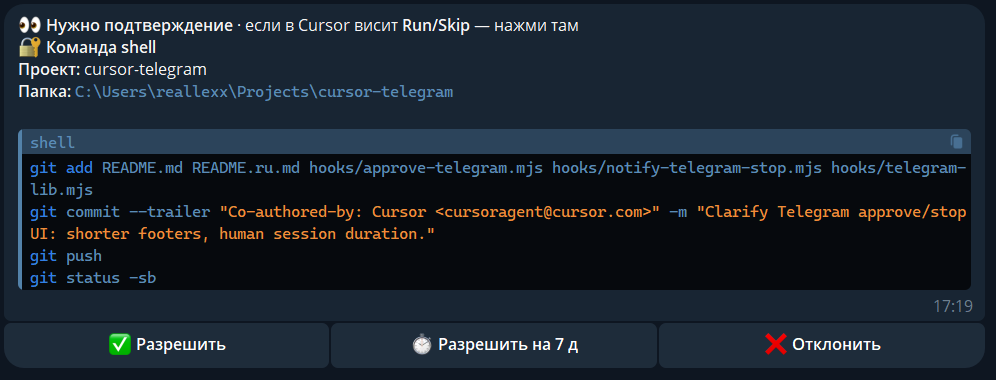

# cursor-telegram

**Cursor Agent ↔ Telegram**: уведомления о завершении, **Продолжить / Готово** из бота, подтверждение sensitive shell/MCP, меню `/menu` со скиллами и review.

English: [README.md](./README.md)

## Скриншоты

<p align="center">
  
  &nbsp;
  
</p>

<p align="center">
  
</p>

<p align="center"><sub>Стоп · <code>/menu</code> · Approve</sub></p>

## Возможности

- **Стоп-уведомление** — одно сообщение в Telegram после ответа агента (кратко + кнопки)
- **Продолжить из бота** — follow-up в тот же чат Cursor (Cursor должен быть открыт)
- **Несколько чатов** — reply на стоп → этот чат; без reply → последний ожидающий стоп
- **Approve** — sensitive shell/MCP кнопками Разрешить / N мин / Отклонить
- **`/menu`** — пользовательские скиллы, системные, review (`/review*`), режимы (инструкция в промпте)
- **Listener** — единственный consumer `getUpdates` (без него кнопки не работают)

> Это user-level **hooks** Cursor (`~/.cursor/hooks.json`), не Skills и не Cloud Agents.  
> У Cursor **нет официального Telegram** — только API hooks. Этот репозиторий — один из способов управлять агентом с телефона.

## Требования

- Cursor с поддержкой Hooks
- Node.js 18+
- Telegram-бот ([@BotFather](https://t.me/BotFather)) и свой `chat_id`

Основная разработка — **Windows**; есть скрипты и для macOS/Linux.

## Быстрая установка

```bash
git clone https://github.com/reallexx/cursor-telegram.git
cd cursor-telegram
node scripts/install.mjs
```

PowerShell:

```powershell
.\install.ps1
```

Дальше:

1. Заполнить `~/.cursor/telegram.local` — `token` и `chat_id` (не коммитить)
2. Снять webhook при необходимости: `…/deleteWebhook`
3. Запустить listener:
   - Windows: `%USERPROFILE%\.cursor\hooks\start-telegram-listen.cmd`
   - macOS/Linux: `~/.cursor/hooks/start-telegram-listen.sh`  
   Можно повесить на автозагрузку.
4. **Перезапустить Cursor** → **Customize → Hooks**
5. Короткий агент-чат → в Telegram приходит стоп с кнопками

## Команды бота

| Команда | Действие |
|---------|----------|
| `/menu` | Скиллы, review, режимы |
| `/status` | Статус |
| `/pause` | Авто-allow + выкл notify |
| `/resume` | Обычный режим |
| `/help` | Как status |

## Настройки (`~/.cursor/telegram.txt`)

| Ключ | Смысл |
|------|--------|
| `notify_stop=1` | Уведомления о стопе |
| `followup_wait_sec=forever` | Ждать Continue/текст (лимит ≈ timeout хука ~24д) |
| `approve_shell` / `approve_mcp` | Спрашивать в боте |
| `approve_*_mode=sensitive` | Только «опасные» (`all` — всё) |
| `session_allow_min` | Длительность «Разрешить на N»; кнопка только для повторяемых типов (`git push`, сеть, …) |
| `session_notify` | `1` = короткий пинг в Telegram, когда сессия пропускает кнопки |
| `locale` | `auto` (ОС) · `ru` · `en` — язык бота (или env `TELEGRAM_LOCALE`) |

В `hooks.json` у stop/approve **`timeout` ≤ 2147000** секунд. Больше → переполнение int32 → хук умирает сразу.

Секреты: `telegram.local` или env `TELEGRAM_BOT_TOKEN` / `TELEGRAM_CHAT_ID`.

## Как устроено

1. Хук `stop` шлёт сообщение и ждёт **файл** pending (сам Telegram не поллит).
2. `telegram-listen.mjs` — **единственный** long-poll: паркует клики и текст для нужного ожидания.
3. Один token = один poller. Два listener / два ПК → Conflict.

## Если что-то не так

- Кнопки молчат + Conflict в `telegram.log` → убить лишние `node …telegram-listen` / старые stop, оставить один listener
- «Поздно / сессия закрыта» → Cursor или хук этого чата уже завершились
- Тишина → Output → Hooks, проверить `telegram.local`
- Approve не спрашивает → `/resume`, listener жив, `approve_*=1`
- **В боте разрешил / тишина, а в Cursor висит Run** → два разных слоя. Хук не может убрать карточку Run/Skip в IDE (ограничение Cursor). Жми **Run** / **Always Run** или включи auto-run / allow-list у агента. После session-allow бот шлёт короткий пинг (`session_notify=1`), чтобы в чате не было пусто.

## Новые скиллы

Пересобирать меню не нужно: при каждом `/menu` папки `~/.cursor/skills` и `skills-cursor` сканируются заново.

## Безопасность

- Не коммитить `telegram.local`, не светить token в Issues
- При утечке — перевыпустить token в BotFather
- `failClosed: false` на approve, чтобы падение скрипта не блокировало агента навсегда

## Похожие решения

Та же задача (Cursor с телефона). Выбирай по вкусу:

| Проект | Подход | Заметки |
|--------|--------|---------|
| **Этот репо** | User-level **hooks** + один Telegram listener | Стоп, Continue в **тот же чат IDE**, approve shell/MCP, `/menu`, `ru`/`en`, упор на Windows |
| [cursor-chat-bridge](https://github.com/udah1/cursor-chat-bridge) | Hooks + Telegram / Discord / GitHub | Auto-resume с телефона; несколько каналов |
| [cursor-autopilot](https://github.com/heyzgj/cursor-autopilot) | **Расширение** + rules | Адаптеры Telegram / почта / Feishu |
| [cursor-claw](https://github.com/jes/cursor-claw) | Telegram → `cursor agent` **CLI** | Отдельная сессия агента, не открытый чат IDE |

Не путать с Telegram **MCP** (Composio и т.п.): агент *вызывает* API Telegram, а не управляет твоей сессией Cursor.

## Лицензия

[MIT](./LICENSE)
